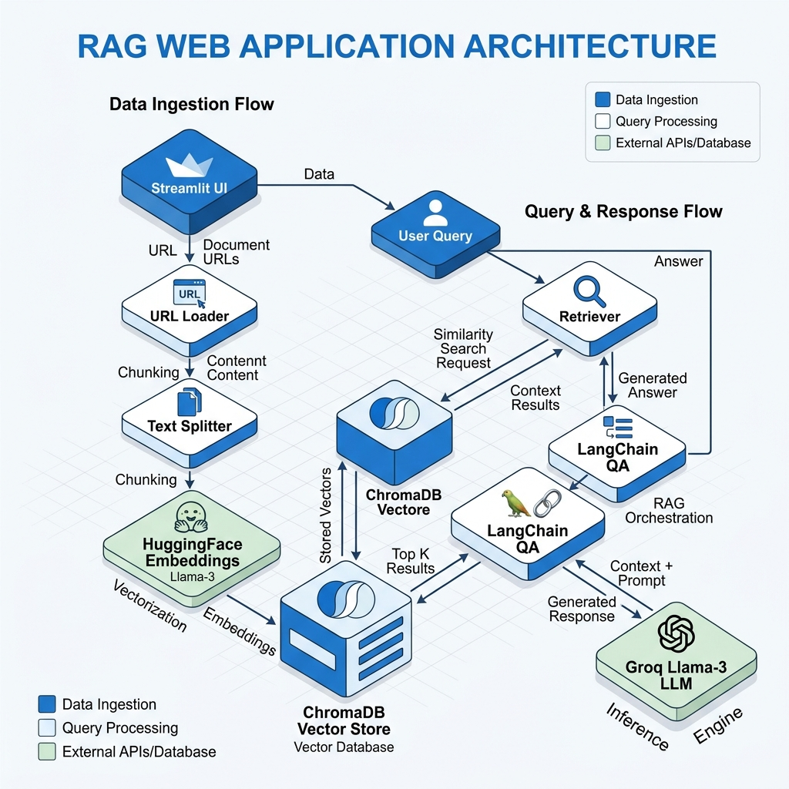

# Multi-Domain RAG Research Tool

## Overview
The Multi-Domain RAG Research Tool is an intelligent web application designed to help users extract actionable insights from unstructured research material across many domains. By providing blog/news URLs, PDF reports, internal documents, or a mix of sources, users can query the application in natural language and receive context-aware answers backed by specific source citations.

This project demonstrates a practical Retrieval-Augmented Generation (RAG) pipeline for reducing research time and improving decision-making across document-heavy workflows.

## Key Features
- **Dynamic Data Ingestion**: Automatically scrapes URLs and loads uploaded PDF documents.
- **Advanced Text Processing**: Utilizes recursive character text splitting to optimize document chunking for maximum retrieval context.
- **High-Performance Vector Storage**: Integrates ChromaDB for efficient semantic search and retrieval of relevant document chunks.
- **State-of-the-Art Language Models**: Powered by the Llama-3.3-70B model via Groq API for rapid and highly coherent answer generation.
- **Source Citation**: Enhances hallucination mitigation and user trust by explicitly returning the sources used to generate each answer.
- **Interactive User Interface**: Features a clean, responsive frontend built with Streamlit for seamless user interaction.
- **Advanced RAG Controls**: Sidebar toggles let you A/B test HyDE, query decomposition, hybrid search, cross-encoder reranking, and Self-RAG reflection against the basic pipeline.

## Technologies and Frameworks
- **LangChain**: Orchestration framework connecting the data ingestion, vector store, and LLM generation chains.
- **Vector Database**: ChromaDB for local vector storage and similarity search operations.
- **Embeddings**: HuggingFace (`sentence-transformers/all-MiniLM-L6-v2`) for generating high-quality text embeddings.
- **Sparse Retrieval**: BM25 via `rank_bm25` and LangChain's community retriever for keyword matching.
- **Reranking**: Local SentenceTransformers cross-encoder (`cross-encoder/ms-marco-MiniLM-L-6-v2`) for post-retrieval ordering.
- **Large Language Model (LLM)**: Llama-3.3-70B-Versatile via ChatGroq for natural language comprehension and generation.
- **Frontend**: Streamlit for rapid deployment of the interactive web application.

## System Architecture

The following diagram illustrates the data flow and system architecture of the RAG pipeline:



### Workflow
1. **Data Extraction**: Unstructured text is extracted from provided web URLs with `WebBaseLoader` and uploaded PDFs with `PyPDFLoader`. Scanned PDFs can use an optional Tesseract OCR fallback.
2. **Parent-Child Chunking**: Larger parent sections are split for LLM context, while smaller child chunks are embedded for precise vector hits.
3. **Embedding and Storage**: Child chunks are converted into dense vectors with HuggingFace embeddings and persisted in local ChromaDB.
4. **Sparse Indexing**: Parent sections are also indexed with BM25 so exact terms, markets, rates, and proper nouns remain retrievable.
5. **Retrieval**: The basic pipeline performs Chroma similarity search. The advanced pipeline can run HyDE, query decomposition, dense/BM25 hybrid retrieval, parent-section expansion, and cross-encoder reranking.
6. **Generation and Reflection**: The final context is passed to Groq for grounded answer generation. Optional Self-RAG graders decide whether retrieval is needed, whether retrieved documents are relevant, and whether the answer is supported by the retrieved text.

## Advanced RAG Architecture

The advanced pipeline is organized around four pillars and can be enabled feature-by-feature in the Streamlit sidebar.

### Pillar 1: Pre-Retrieval (`pre_retrieval.py`)
- **HyDE** uses a fast Groq model to write a hypothetical ideal answer, then embeds that text for vector search.
- **Query Decomposition** detects comparative or multi-part questions and splits them into independent sub-queries before retrieval.

### Pillar 2: Advanced Retrieval (`rag.py`)
- **Hybrid Search** combines dense Chroma retrieval and sparse BM25 retrieval with tunable weights.
- **Parent-Child Chunking** embeds compact child chunks for precision while returning larger parent sections to the LLM.

### Pillar 3: Post-Retrieval (`rerank.py`)
- **Cross-Encoder Reranking** uses a free local SentenceTransformers model to reorder retrieved chunks by query relevance before generation.
- `top_k_retrieve` and `top_n_rerank` are configurable from the UI.

### Pillar 4: Generation + Self-Reflection (`self_rag.py`)
- **IsRetrieve** decides whether the query needs document retrieval.
- **IsRelevant** grades retrieved documents and retries with a rewritten query when relevance is weak.
- **IsSupportive** grades whether the final answer is grounded in retrieved text and can trigger regeneration or a low-confidence flag.

The UI includes an expandable reasoning trace showing which steps ran, decomposed sub-queries, HyDE text, retrieved counts, reranker scores, and Self-RAG verdicts.

## Model Configuration

You can swap models without code changes by setting environment variables:

```text
GROQ_GENERATION_MODEL=llama-3.3-70b-versatile
GROQ_HYDE_MODEL=llama-3.1-8b-instant
GROQ_GRADER_MODEL=llama-3.1-8b-instant
APP_NAME=Multi-Domain RAG Research Tool
ASSISTANT_ROLE=domain-neutral research assistant
EMBEDDING_MODEL=sentence-transformers/all-MiniLM-L6-v2
RERANK_MODEL=cross-encoder/ms-marco-MiniLM-L-6-v2
RAG_PARENT_CHUNK_SIZE=1800
RAG_CHILD_CHUNK_SIZE=450
MAX_PDF_UPLOADS=50
PDF_LOAD_BATCH_SIZE=5
VECTOR_ADD_BATCH_SIZE=500
ENABLE_PDF_OCR=true
OCR_MIN_PAGE_CHARS=80
OCR_DPI=200
```

## Project Structure
```text
multi_domain_rag_tool/
├── main.py            # Streamlit application entry point. Handles the UI, state management, and user interactions.
├── rag.py             # Core and advanced RAG orchestration, ingestion, retrieval, generation, and source extraction.
├── pre_retrieval.py   # HyDE and query decomposition.
├── rerank.py          # Local cross-encoder reranking.
├── self_rag.py        # Self-RAG JSON graders and retry decisions.
├── prompt.py          # Optional custom prompt templates for source-grounded answers.
├── validation.py      # Utility functions for validating user-provided API keys asynchronously.
├── requirements.txt   # List of Python dependencies required to run the application.
├── .env.example       # Template for environment variables (e.g., GROQ_API_KEY).
├── .gitignore         # Git ignore rules to prevent tracking sensitive or unnecessary files.
├── Readme.md          # Project documentation (this file).
└── resources_RAG/     # Directory for local vector store, uploads, and assets.
    └── vectorstore/   # ChromaDB persistent storage location where generated embeddings are saved.
```

## Installation and Setup

### Prerequisites
- Python 3.9 or higher
- An active [Groq API key](https://console.groq.com/keys)

### Steps
1. Clone the repository to your local machine:
   ```bash
   git clone <your-repository-url>
   cd multi_domain_rag_tool
   ```

2. Install the required dependencies:
   ```bash
   pip install -r requirements.txt
   ```

   For scanned/image-only PDFs, install the local OCR tools too:
   ```bash
   brew install tesseract poppler
   ```

3. Set up the environment variables:
   Create a `.env` file in the root directory and add your Groq API key:
   ```text
   GROQ_API_KEY=your_api_key_here
   ```

4. Run the Streamlit application:
   ```bash
   streamlit run main.py
   ```

5. In the sidebar, provide one or more URLs, upload up to 50 PDFs, or use both together. Click **Process Sources** before asking questions.

For larger PDF batches, keep an eye on local memory and processing time. The app loads PDFs incrementally and writes Chroma vectors in batches. If a PDF page has little selectable text, the optional OCR fallback renders pages with Poppler and extracts text with Tesseract before indexing.

## Current Development Status
The core RAG pipeline and user interface are fully functional for multi-domain document research. You can tune `ASSISTANT_ROLE` for a specific corpus, such as policy analyst, medical literature assistant, legal research assistant, or technical documentation assistant.
