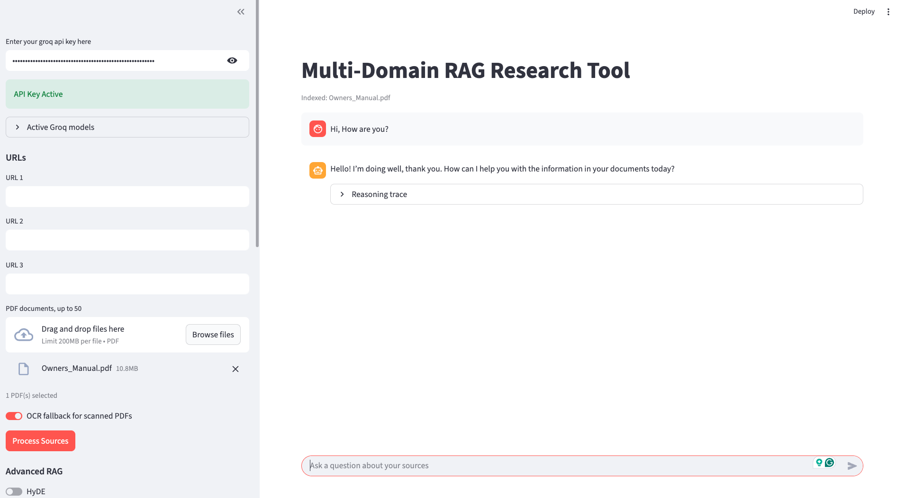
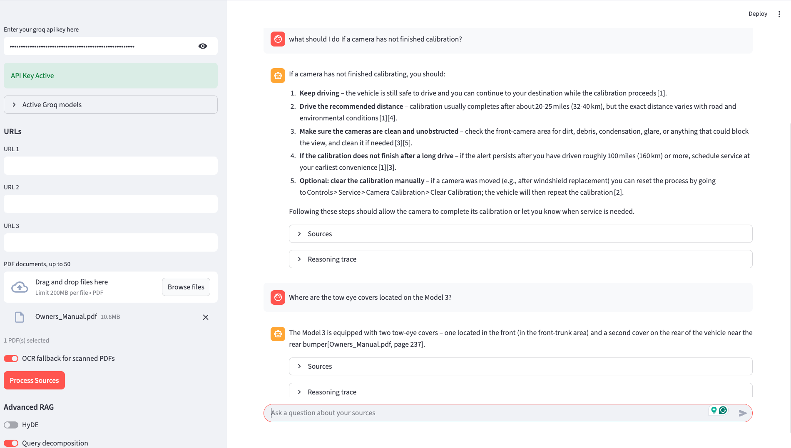

# Production-inspired Advanced RAG Architecture

## Overview
Production-inspired Advanced RAG Architecture is an intelligent web application designed to help users extract actionable insights from unstructured research material across many domains. By providing blog/news URLs, PDF reports, internal documents, or a mix of sources, users can query the application in natural language and receive context-aware answers backed by specific source citations.

This project demonstrates a practical Retrieval-Augmented Generation (RAG) pipeline for reducing research time and improving decision-making across document-heavy workflows.

## Key Features
- **Dynamic Data Ingestion**: Automatically scrapes URLs and loads uploaded PDF documents.
- **Advanced Text Processing**: Utilizes recursive character text splitting to optimize document chunking for maximum retrieval context.
- **High-Performance Vector Storage**: Integrates ChromaDB for efficient semantic search and retrieval of relevant document chunks.
- **Resilient Model Selection**: Model ids are resolved against the live Groq catalogue for your API key, so a model Groq retires falls back to the best available substitute instead of failing the request.
- **Semantic Routing**: Greetings, thanks, and questions about the assistant itself are classified by embedding similarity and answered directly, so they never reach the retriever.
- **Source Citation**: Enhances hallucination mitigation and user trust by explicitly returning the sources used to generate each answer.
- **Chat Interface**: A Streamlit chat frontend where the whole session stays on screen, with per-message sources and reasoning trace.
- **Conversation Memory**: Recent turns are kept verbatim, older turns are folded into a running summary, and follow-up questions are rewritten into standalone retrieval queries.
- **Prompt Caching**: Fixed system prompts plus a local exact-match cache cut repeat latency and token spend.
- **Advanced RAG Controls**: Sidebar toggles let you A/B test HyDE, query decomposition, hybrid search, cross-encoder reranking, and Self-RAG reflection against the basic pipeline.

## Technologies and Frameworks
- **LangChain**: Orchestration framework connecting the data ingestion, vector store, and LLM generation chains.
- **Vector Database**: ChromaDB for local vector storage and similarity search operations.
- **Embeddings**: HuggingFace (`sentence-transformers/all-MiniLM-L6-v2`) for generating high-quality text embeddings.
- **Sparse Retrieval**: BM25 via `rank_bm25` and LangChain's community retriever for keyword matching.
- **Reranking**: Local SentenceTransformers cross-encoder (`cross-encoder/ms-marco-MiniLM-L-6-v2`) for post-retrieval ordering.
- **Large Language Model (LLM)**: A Groq-hosted chat model via ChatGroq, selected per role by `groq_models.py` from the ids available to your key.
- **Frontend**: Streamlit for rapid deployment of the interactive web application.

## System Architecture

The diagram below shows the full pipeline. Ingestion runs offline along the top. The query path runs left to right through the middle. Self-RAG reflection hangs beneath it as an overlay, and the cross-cutting services at the bottom touch every stage.


Two paths through the diagram are worth following. The **green path** leaves the semantic router and reaches the answer without touching retrieval at all; this is what conversational messages do. The **orange node** is where dense and sparse results are fused before reranking; this is what document questions do.

### The interface

The sidebar is the control plane for ingestion and retrieval. You supply URLs, upload PDFs, toggle the OCR fallback, and switch individual advanced RAG modules on or off before processing sources. The **Active Groq models** expander reports which model each role resolved to and warns when a configured id was unavailable.

The screenshot below shows a first exchange after loading `Owners_Manual.pdf`. Note what the greeting produced: a direct reply, a reasoning trace, and **no Sources expander**, because the semantic router classified the message as conversational and skipped retrieval entirely.



The next screenshot shows the same session answering document questions through the advanced pipeline. Each answer carries its own Sources and Reasoning trace expanders, and citations are rendered as `[Owners_Manual.pdf, page 237]` pointing back to the exact page. The trace exposes which components ran on that specific message, which is what makes retrieval behavior debuggable and makes architecture variants comparable during LangSmith evaluation.



### Workflow
0. **Semantic Routing**: Every incoming message is first classified by embedding similarity. Conversational messages are answered directly and skip the rest of the pipeline; only document questions continue below.
1. **Data Extraction**: Unstructured text is extracted from provided web URLs with `WebBaseLoader` and uploaded PDFs with `PyPDFLoader`. Scanned PDFs can use an optional Tesseract OCR fallback.
2. **Parent-Child Chunking**: Larger parent sections are split for LLM context, while smaller child chunks are embedded for precise vector hits.
3. **Embedding and Storage**: Child chunks are converted into dense vectors with HuggingFace embeddings and persisted in local ChromaDB.
4. **Sparse Indexing**: Parent sections are also indexed with BM25 so exact terms, markets, rates, and proper nouns remain retrievable.
5. **Memory and Condensing**: The follow-up is rewritten into a standalone retrieval query against the conversation, while the generator still answers the question as the user phrased it.
6. **Retrieval**: The basic pipeline performs Chroma similarity search. The advanced pipeline can run HyDE, query decomposition, dense/BM25 hybrid retrieval, parent-section expansion, and cross-encoder reranking.
7. **Generation and Reflection**: The final context is passed to Groq for grounded answer generation. Optional Self-RAG graders judge whether retrieved documents are relevant and whether the answer is supported by the retrieved text, retrying or flagging low confidence when they are not.
8. **Citation Normalization**: Model-specific citation brackets are rewritten into plain `[source, page]` form before the answer reaches the UI.

## Production-inspired Advanced RAG Architecture

The advanced pipeline is organized around four pillars and can be enabled feature-by-feature in the Streamlit sidebar.

### Pillar 1: Pre-Retrieval (`pre_retrieval.py`)
- **HyDE** uses a fast Groq model to write a hypothetical ideal answer, then embeds that text for vector search.
- **Query Decomposition** detects comparative or multi-part questions and splits them into independent sub-queries before retrieval.

### Pillar 2: Advanced Retrieval (`rag.py`)
- **Hybrid Search** combines dense Chroma retrieval and sparse BM25 retrieval with tunable weights.
- **Parent-Child Chunking** embeds compact child chunks for precision while returning larger parent sections to the LLM.

### Pillar 3: Post-Retrieval (`rerank.py`)
- **Cross-Encoder Reranking** uses a free local SentenceTransformers model to reorder retrieved chunks by query relevance before generation.
- `top_k_retrieve` and `top_n_rerank` are configurable from the UI.

### Pillar 4: Generation + Self-Reflection (`self_rag.py`)
- **IsRetrieve** grades whether the query needs document retrieval. Its verdict is recorded in the trace but is advisory, because the semantic router already owns that decision. See Semantic Routing below.
- **IsRelevant** grades retrieved documents and retries with a rewritten query when relevance is weak.
- **IsSupportive** grades whether the final answer is grounded in retrieved text and can trigger regeneration or a low-confidence flag.

### Conversation Memory (`memory.py`)
The chat is stateful. `ConversationMemory` keeps the last `MEMORY_WINDOW_TURNS` question/answer pairs verbatim and folds anything older into a running summary with the fast Groq model, so the prompt stays bounded however long the session runs.

Before retrieval, every follow-up is condensed into a standalone query. "And the rear ones?" is useless as a vector query on its own, so the memory module rewrites it against the conversation and hands the retrievers something self-contained. The original wording is still what the generator answers. The reasoning trace shows the rewritten query whenever it differs from what you typed.

The sidebar controls the window size and can clear the thread. Processing new sources also starts a fresh thread, since earlier answers refer to a corpus that no longer exists.

### Semantic Routing (`semantic_router.py`)
"Hi", "thanks, that helped", and "what can you do?" have no answer in the user's documents. Running them through retrieval wastes an embedding search and several LLM calls, and it pushes the model to answer social messages out of unrelated document chunks.

Classification is done by embedding similarity rather than an LLM call. The message is embedded once with the same model that powers retrieval, then compared against labeled exemplar utterances for `greeting`, `gratitude`, `farewell`, `smalltalk`, `capability`, and `document_qa`. Because document questions are a route with their own exemplars, a message is only treated as conversational when it beats them by a margin, not merely by clearing a fixed threshold. Two guards sit in front of the embedding step: the most common single utterances are matched exactly, and any message longer than `SEMANTIC_ROUTER_MAX_WORDS` is sent to retrieval, so "hi, what is the service interval for the rear axle?" is treated as the document question it is.

The thresholds ship at the mid-point of the band that misclassified nothing in either direction on a held-out set of 30 conversational and 30 document questions. If routing fails for any reason, the message goes to retrieval, so the router can never block a document question. Conversational replies come from the small helper model with a fixed system prompt, and each route carries a static fallback reply for when that call fails.

Routing also settles an ambiguity in Self-RAG. Its `IsRetrieve` grader used to be able to answer a document question from general knowledge with no citations; now that the router owns the retrieve-or-not decision, that verdict is recorded in the trace but cannot bypass the corpus.

### Model Resolution (`groq_models.py`)
Groq retires hosted model ids on a rolling basis, and a retired id fails at request time with a 404 that reaches the user as a broken answer. Every module asks this registry for its model instead of naming one directly. The registry reads the catalogue for the active API key, and when the configured id is missing it falls back through a per-role preference list, then to the largest available chat model. The sidebar shows what each role requested and what will actually be called, and warns when the two differ.

The lookup is fail-soft: with no key, no network, or a self-hosted gateway, the configured id is returned unvalidated so the registry never becomes a new point of failure. The catalogue is cached per key with a TTL and re-read when the key changes. The registry also decides whether to send a `reasoning_effort` hint, which matters because reasoning models spend part of the completion budget before emitting a JSON verdict.

### Prompt Caching (`llm_cache.py`)
Every Groq call in the project, including generation, HyDE, decomposition, the Self-RAG graders, and the memory summarizer, goes through `cached_chat`. Two layers do the work.

**Server-side prefix caching.** Groq reuses the KV cache of a request whose prompt shares a prefix with a recent one. Each call therefore sends a fixed system message first and puts volatile text last, in the order conversation history, retrieved context, current question. The instruction blocks are module constants with no per-question interpolation, so they are byte-identical every time. The sidebar reports the share of prompt tokens Groq says it actually reused.

**Local exact-match caching.** Identical model, system, and user triples never leave the process. This absorbs Streamlit reruns, repeated questions, and the heavy grader traffic of an evaluation sweep. The cache is an LRU with a TTL, sized by `PROMPT_CACHE_MAX_ENTRIES` and `PROMPT_CACHE_TTL_SECONDS`, and it can be cleared from the sidebar or disabled with `PROMPT_CACHE_ENABLED=false`.

The UI includes an expandable reasoning trace showing the semantic route and its per-route scores, which steps ran, memory state and any query rewrite, decomposed sub-queries, HyDE text, retrieved counts, reranker scores, Self-RAG verdicts, and cache statistics.

## Model Configuration

You can swap models without code changes by setting environment variables:

Each id is checked against the models your API key can actually call. If one is unavailable the app substitutes the best alternative for that role and says so in the sidebar, so a retired model id degrades rather than breaking the app.

```text
GROQ_GENERATION_MODEL=openai/gpt-oss-120b
GROQ_HYDE_MODEL=openai/gpt-oss-20b
GROQ_GRADER_MODEL=openai/gpt-oss-20b
GROQ_ROUTER_MODEL=openai/gpt-oss-20b
GROQ_JUDGE_MODEL=openai/gpt-oss-120b
GROQ_GENERATION_MAX_TOKENS=1400
GROQ_GENERATION_REASONING_EFFORT=medium
GROQ_HELPER_REASONING_EFFORT=low
GROQ_MODEL_CATALOGUE_TTL_SECONDS=900
SEMANTIC_ROUTER_ENABLED=true
SEMANTIC_ROUTER_THRESHOLD=0.40
SEMANTIC_ROUTER_MARGIN=0.15
SEMANTIC_ROUTER_MAX_WORDS=14
APP_NAME=Production-inspired Advanced RAG Architecture
ASSISTANT_ROLE=domain-neutral research assistant
EMBEDDING_MODEL=sentence-transformers/all-MiniLM-L6-v2
RERANK_MODEL=cross-encoder/ms-marco-MiniLM-L-6-v2
GROQ_MEMORY_MODEL=openai/gpt-oss-20b
MEMORY_WINDOW_TURNS=6
MEMORY_ANSWER_CHARS=700
MEMORY_CONDENSE_QUESTIONS=true
PROMPT_CACHE_ENABLED=true
PROMPT_CACHE_MAX_ENTRIES=256
PROMPT_CACHE_TTL_SECONDS=3600
RAG_PARENT_CHUNK_SIZE=1800
RAG_CHILD_CHUNK_SIZE=450
MAX_PDF_UPLOADS=50
PDF_LOAD_BATCH_SIZE=5
VECTOR_ADD_BATCH_SIZE=500
ENABLE_PDF_OCR=true
OCR_MIN_PAGE_CHARS=80
OCR_DPI=200
```

## Project Structure
```text
multi_domain_rag_tool/
├── main.py            # Streamlit chat application entry point. Handles the UI, state management, and user interactions.
├── rag.py             # Core and advanced RAG orchestration, ingestion, retrieval, generation, and source extraction.
├── semantic_router.py # Embedding-based routing of conversational messages away from retrieval.
├── groq_models.py     # Resolves Groq model ids against the live catalogue and builds chat clients.
├── memory.py          # Conversation memory: rolling window, running summary, follow-up question condensing.
├── llm_cache.py       # Prompt caching: cache-friendly message layout plus a local exact-match cache.
├── pre_retrieval.py   # HyDE and query decomposition.
├── rerank.py          # Local cross-encoder reranking.
├── self_rag.py        # Self-RAG JSON graders and retry decisions.
├── prompt.py          # Optional custom prompt templates for source-grounded answers.
├── validation.py      # Utility functions for validating user-provided API keys asynchronously.
├── requirements.txt   # List of Python dependencies required to run the application.
├── .env.example       # Template for environment variables (e.g., GROQ_API_KEY).
├── .gitignore         # Git ignore rules to prevent tracking sensitive or unnecessary files.
├── Readme.md          # Project documentation (this file).
└── resources_RAG/     # Directory for local vector store, uploads, and assets.
    └── vectorstore/   # ChromaDB persistent storage location where generated embeddings are saved.
```

## Installation and Setup

### Prerequisites
- Python 3.9 or higher
- An active [Groq API key](https://console.groq.com/keys)

### Steps
1. Clone the repository to your local machine:
   ```bash
   git clone <your-repository-url>
   cd multi_domain_rag_tool
   ```

2. Install the required dependencies:
   ```bash
   pip install -r requirements.txt
   ```

   For scanned/image-only PDFs, install the local OCR tools too:
   ```bash
   brew install tesseract poppler
   ```

3. Set up the environment variables:
   Create a `.env` file in the root directory and add your Groq API key:
   ```text
   GROQ_API_KEY=your_api_key_here
   ```

4. Run the Streamlit application:
   ```bash
   streamlit run main.py
   ```

5. In the sidebar, provide one or more URLs, upload up to 50 PDFs, or use both together. Click **Process Sources**, then ask questions in the chat box. Follow-up questions resolve against the conversation, so you can keep drilling into the same topic without repeating yourself.

For larger PDF batches, keep an eye on local memory and processing time. The app loads PDFs incrementally and writes Chroma vectors in batches. If a PDF page has little selectable text, the optional OCR fallback renders pages with Poppler and extracts text with Tesseract before indexing.

## LangSmith Evaluation

Use `evaluate_rag_langsmith.py` to evaluate the RAG pipeline against `Owners_Manual.pdf` and `testsets/testset.json`.

Add LangSmith credentials to `.env`:

```text
GROQ_API_KEY=your_groq_api_key_here
LANGSMITH_API_KEY=your_langsmith_api_key_here
LANGSMITH_TRACING=true
```

Run the default evaluation:

```bash
python evaluate_rag_langsmith.py
```

The runner indexes `Owners_Manual.pdf`, sends each `testsets/testset.json` question through the RAG system, and logs the experiment to LangSmith with deterministic, LLM-as-judge, and operational evaluators.

Before each run, the script syncs the local testset into LangSmith using stable example IDs. If the examples do not exist, it creates them; if they already exist from a previous run, it updates them and continues.

The logged metrics include:
- `answer_similarity`
- `keyword_recall`
- `groundedness`
- `faithfulness`
- `context_relevance`
- `answer_relevance`
- `insufficient_context_agreement`
- `citation_presence`
- `expected_page_citation_match`
- `latency_seconds`
- `answer_word_count`
- `answer_char_count`
- `source_count`
- `citation_count`
- `retrieved_count` when the RAG trace reports it
- `trace_step_count`

LangSmith tracing also captures run traces and model-call metadata, such as latency and token usage, when the underlying model integration reports it.

The groundedness, faithfulness, context relevance, and answer relevance metrics come from a single LLM-as-judge call using the model from `GROQ_JUDGE_MODEL`. These metric names follow the RAGAS vocabulary, but the implementation is local to this repository; RAGAS itself is not a dependency. The remaining metrics are deterministic and need no judge. To run a cheaper deterministic-only evaluation without these LLM-as-judge metrics:

```bash
python evaluate_rag_langsmith.py --skip-llm-judge
```

For the best retrieval performance, keep Self-RAG reflection off and turn on the other advanced RAG features. Self-RAG reflection can add extra grading calls and may make the run slower or more conservative, so the recommended evaluation command is:

```bash
python evaluate_rag_langsmith.py --hyde --decomposition --hybrid --rerank --top-k 10 --top-n 5
```

Do not add `--self-rag` when using this recommended setup. Parent-child retrieval is already enabled by default.

For a faster advanced retrieval run without HyDE or decomposition:

```bash
python evaluate_rag_langsmith.py --hybrid --rerank --top-k 10 --top-n 5
```

To use a custom LangSmith dataset name:

```bash
python evaluate_rag_langsmith.py --dataset-name model-3-owners-manual-rag-testset
```

## Current Development Status
The core RAG pipeline and user interface are fully functional for multi-domain document research. You can tune `ASSISTANT_ROLE` for a specific corpus, such as policy analyst, medical literature assistant, legal research assistant, or technical documentation assistant.

Recent work hardened two things that break silently in production. Model ids are no longer trusted blindly, because Groq retires them and a retired id surfaces to the user as a failed answer rather than an obvious configuration error. And conversational messages no longer enter the retrieval pipeline, because answering "hi" out of unrelated document chunks is both wasteful and wrong.
